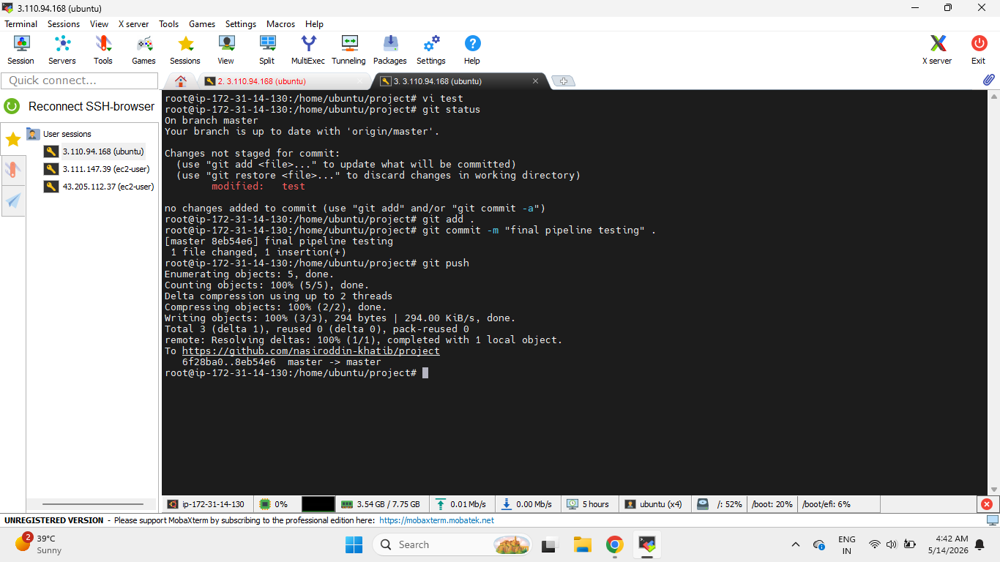
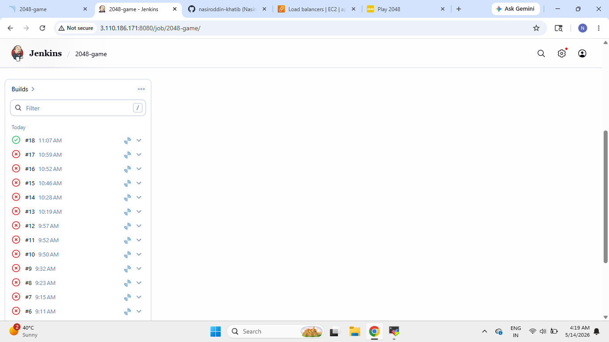
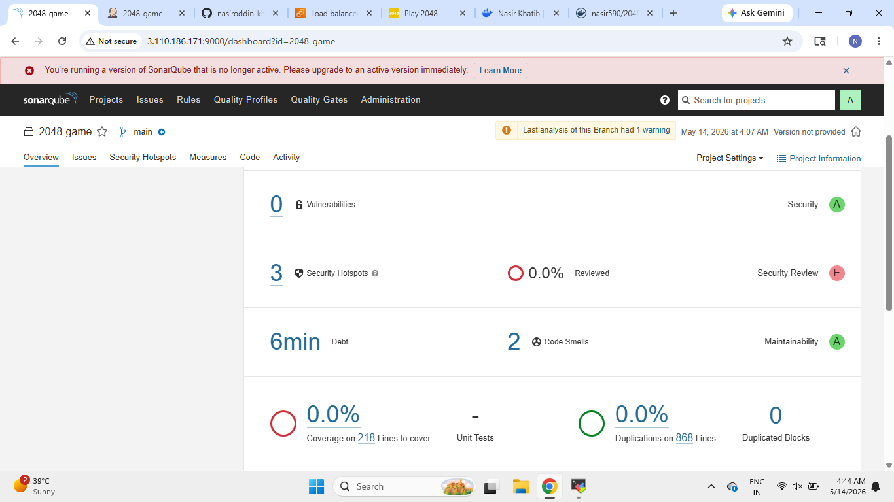
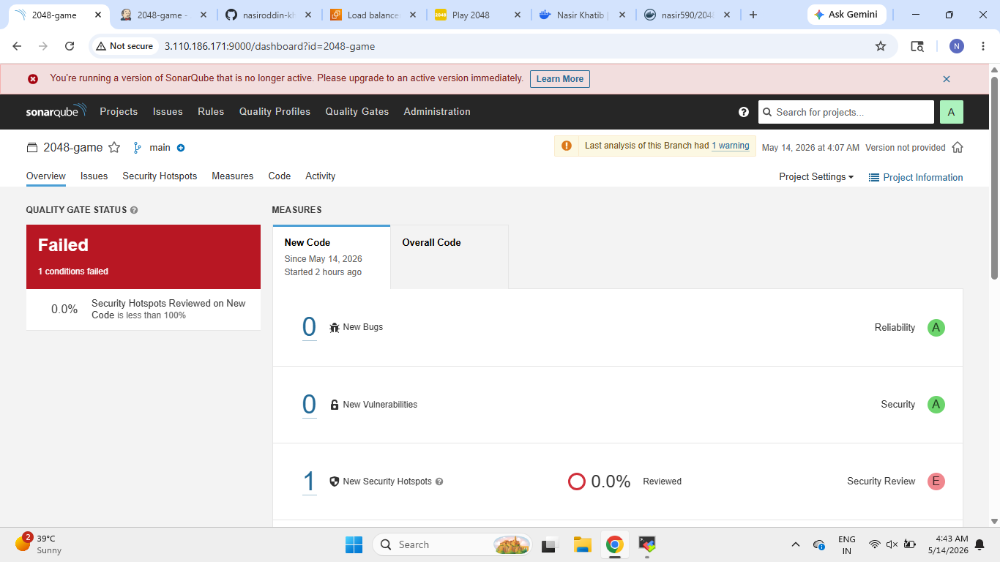
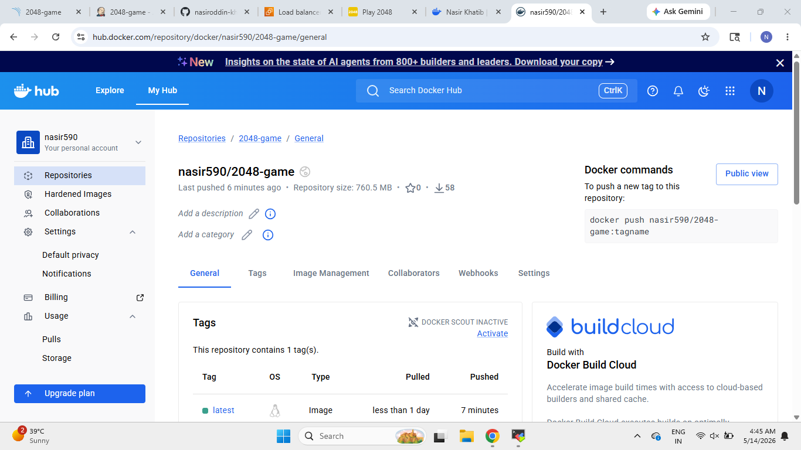
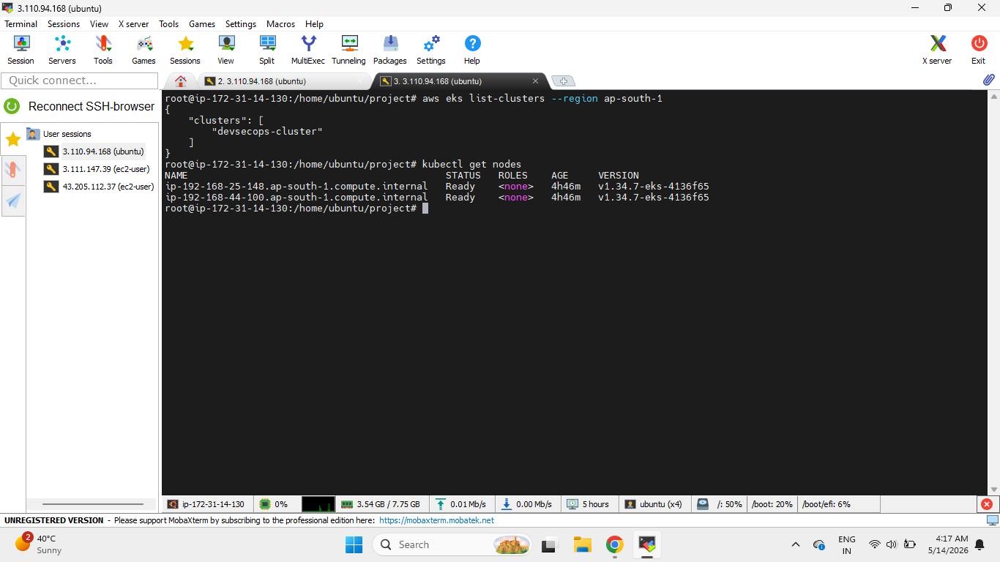
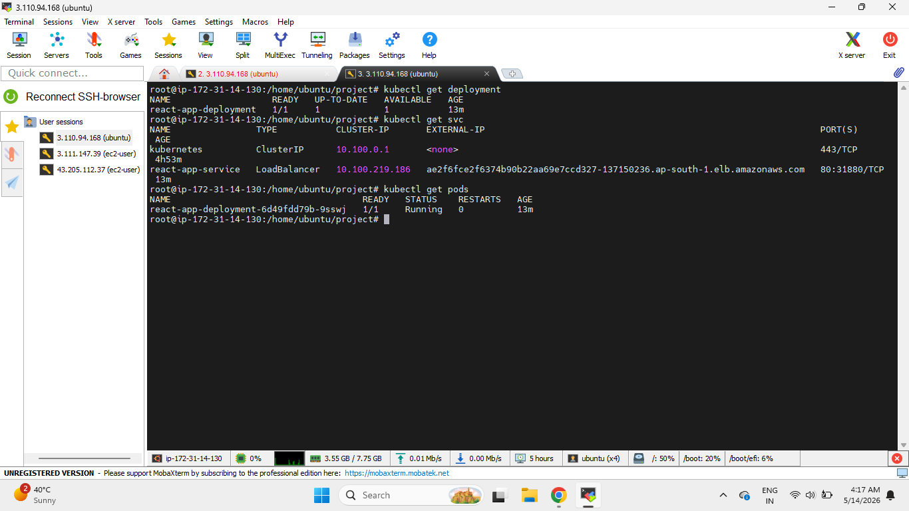
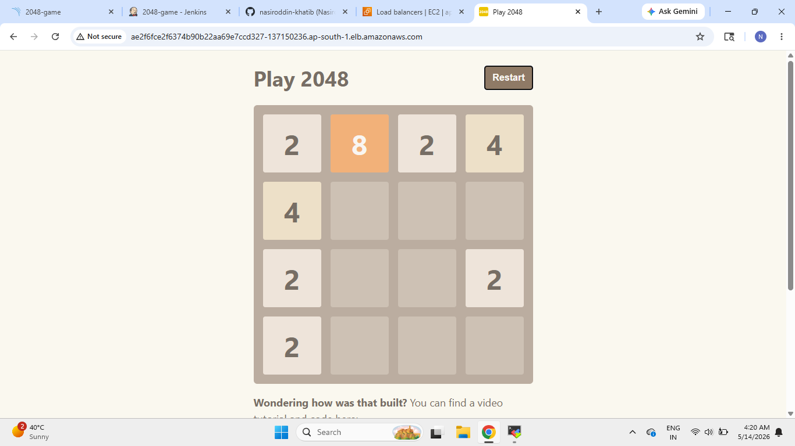

# 🚀 2048 Game DevSecOps CI/CD Pipeline on AWS EKS

## 📌 Project Overview

This project demonstrates a complete end-to-end **DevSecOps CI/CD Pipeline** for deploying a **React-based 2048 Game Application** on **Amazon EKS (Elastic Kubernetes Service)**.

The entire workflow is automated using Jenkins and integrates multiple DevOps and security tools including:

* GitHub
* Jenkins
* SonarQube
* Trivy
* Docker
* Docker Hub
* Kubernetes
* Amazon EKS
* AWS LoadBalancer

The pipeline automatically builds, scans, secures, containerizes, and deploys the application to Kubernetes on AWS.

---

# 🏗️ Complete DevSecOps CI/CD Workflow

```text id="w6f9xe"
Developer Push Code
        ↓
GitHub Repository
        ↓
Jenkins Pipeline Trigger
        ↓
Clean Workspace
        ↓
Checkout Source Code
        ↓
SonarQube Code Analysis
        ↓
Install Dependencies (npm install)
        ↓
Trivy Filesystem Scan
        ↓
Docker Image Build
        ↓
Docker Image Tagging
        ↓
Push Image to Docker Hub
        ↓
Trivy Image Scan
        ↓
Deploy to Kubernetes (Amazon EKS)
        ↓
Create Kubernetes LoadBalancer Service
        ↓
AWS Elastic Load Balancer Provisioned
        ↓
Kubernetes Pods Running
        ↓
2048 Game Accessible Publicly
```

---

# ⚙️ Technologies Used

| Tool / Service     | Purpose                     |
| ------------------ | --------------------------- |
| React + TypeScript | Frontend Application        |
| GitHub             | Source Code Management      |
| Jenkins            | CI/CD Automation            |
| SonarQube          | Static Code Analysis        |
| Trivy              | Vulnerability Scanning      |
| Docker             | Containerization            |
| Docker Hub         | Container Registry          |
| Kubernetes         | Container Orchestration     |
| Amazon EKS         | Managed Kubernetes Service  |
| AWS LoadBalancer   | Public Application Exposure |

---

# 📂 Project Structure

```text id="mq4t8j"
project/
│
├── public/
├── screenshots/
├── src/
│
├── Dockerfile
├── Jenkinsfile
├── deployment.yaml
├── service.yaml
├── package.json
├── tsconfig.json
└── README.md
```

---

# 🔄 Step 1: Push Code to GitHub

The complete CI/CD pipeline starts when source code is pushed to the GitHub repository.

Once the code is pushed, Jenkins automatically triggers the pipeline.

## Git Push Trigger



---

# ⚙️ Step 2: Jenkins Pipeline Triggered

After detecting changes in the GitHub repository, Jenkins starts the automated DevSecOps pipeline.

The pipeline handles:

* Code Integration
* Security Scanning
* Docker Build
* Kubernetes Deployment
* Application Delivery

## Jenkins Pipeline Execution



---

# 🔍 Step 3: SonarQube Static Code Analysis

Jenkins performs static code analysis using SonarQube to identify:

* Code Smells
* Vulnerabilities
* Security Hotspots
* Maintainability Issues
* Quality Gate Status

---

## SonarQube Quality Gate Overview



---

## SonarQube Quality Gate Status



---

# 📦 Step 4: Install Application Dependencies

After SonarQube analysis, Jenkins installs all required application dependencies using:

```bash id="nqv4rm"
npm install
```

This prepares the application for:

* Security Scanning
* Docker Build
* Deployment

---

# 🛡️ Step 5: Trivy Filesystem Security Scan

Trivy performs filesystem vulnerability scanning on the application source code and dependencies.

## Trivy Filesystem Scan Command

```bash id="ccgsnn"
trivy fs .
```

This helps identify vulnerable packages and dependency-related security issues before containerization.

---

# 🐳 Step 6: Docker Image Build

After successful scanning, Jenkins builds the Docker image for the application.

## Docker Build Command

```bash id="v2yktw"
docker build -t 2048-game .
```

The application is now containerized and ready for deployment.

---

# 🏷️ Step 7: Docker Image Tagging

The Docker image is tagged before pushing it to Docker Hub.

## Docker Tag Command

```bash id="x9j1hf"
docker tag 2048-game nasir590/2048-game:latest
```

---

# 📤 Step 8: Push Docker Image to Docker Hub

The Docker image is pushed to Docker Hub so Kubernetes can pull and deploy it.

## Docker Push Command

```bash id="fx2iqz"
docker push nasir590/2048-game:latest
```

---

## Docker Hub Repository



---

# 🔐 Step 9: Trivy Docker Image Scan

Before deployment, Trivy scans the Docker image for container vulnerabilities.

## Trivy Docker Image Scan Command

```bash id="fcl1vt"
trivy image nasir590/2048-game:latest
```

This ensures the container image is checked for known security vulnerabilities.

---

# ☁️ Step 10: Deploy Application to Amazon EKS

After successful scanning and image push, Jenkins deploys the application to Amazon EKS using Kubernetes manifests.

The deployment includes:

* Kubernetes Deployment
* Kubernetes Service
* AWS LoadBalancer

---

# ☸️ Amazon EKS Cluster and Worker Nodes

The Kubernetes cluster is running successfully on Amazon EKS with active worker nodes.



---

# 📦 Step 11: Kubernetes Pods Running Successfully

Kubernetes creates and manages the application pods after deployment.

## Running Pods



---

# 🌐 Step 12: Application Exposed Using AWS LoadBalancer

The Kubernetes service is configured as:

```yaml id="6y4c7k"
type: LoadBalancer
```

This automatically provisions an AWS Elastic Load Balancer and exposes the application publicly.

---

# 🚀 Step 13: 2048 Game Successfully Deployed

The React-based 2048 Game application is successfully deployed and accessible publicly using the AWS LoadBalancer DNS endpoint.

## Live Application



---

# 📜 Kubernetes Commands Used

## Deploy Kubernetes Resources

```bash id="lmdxqk"
kubectl apply -f deployment.yaml
kubectl apply -f service.yaml
```

---

## Verify Running Pods

```bash id="scg22g"
kubectl get pods
```

---

## Verify Kubernetes Services

```bash id="28m8zy"
kubectl get svc
```

---

# 📈 Project Highlights

✅ End-to-End DevSecOps CI/CD Pipeline

✅ Automated Jenkins Pipeline

✅ SonarQube Static Code Analysis

✅ Trivy Security Scanning

✅ Docker Containerization

✅ Docker Hub Integration

✅ Kubernetes Deployment

✅ Amazon EKS Integration

✅ AWS LoadBalancer Exposure

✅ Publicly Accessible Application

---

# 🎯 Key Learning Outcomes

Through this project, I gained hands-on experience with:

* CI/CD Pipeline Automation
* Jenkins Pipeline Development
* DevSecOps Workflow Implementation
* Static Code Analysis
* Container Security Scanning
* Docker Image Management
* Kubernetes Deployments & Services
* Amazon EKS Cluster Management
* AWS LoadBalancer Configuration
* End-to-End Cloud Native Application Deployment

---

# 👨‍💻 Author

## Nasir Khatib

GitHub:
https://github.com/nasiroddin-khatib
